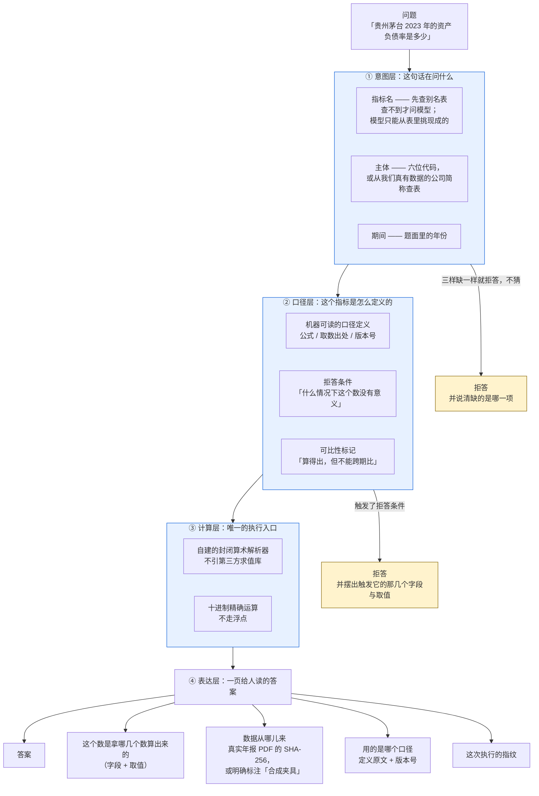

# 可审计财务分析 Agent —— 一页架构

> `D-005` 三样对外展示物之一。**不含实现细节**，是给人看「它凭什么敢说自己可审计」的。

## 一句话

给一个自然语言的财务问题，它要么给出一个数**并附上足以让人自己重算一遍的东西**，
要么明确拒答**并说清缺的是什么**。**拒答不是失败，是一种正确输出。**

## 去哪儿试

**演示链接**：<https://cninfo-analyzer-web.pages.dev/#/audit>

它是 `D-005` 三样对外展示物里的第二样。**不需要装任何东西，点开就能问。**

- 覆盖面自查：<https://cninfo-analyzer-web.pages.dev/api/audit/coverage>
  —— 它会如实报出哪几行来自真实年报（`nature: real`）、哪几行是虚构夹具（`synthetic`）。
- 后端是 `RGT07/cninfo-financial-analyzer` 这个 Space 的 `/audit/*`；
  **令牌由 Cloudflare 的 Pages Function 在服务端注入，不出现在浏览器里**。
- 真实公司目前只有 **2 家 3 个年度**（贵州茅台 2023、万华化学 2019），
  因为**导出清单等于人工逐字段核对过的清单** —— 没人核过的公司不导出。
  顺丰 2021 的 PDF 在磁盘上，一个字段都没核，所以它不在里面。

---

## 一次提问经过哪些地方

## 四条把它和「一个会算财务指标的聊天机器人」分开的设计

### 一、模型只在一个地方，而且只做一件事

全系统只有**意图层**允许语言模型介入，它的工作是**把一种说法归一到一个已经存在的
指标名**。它不产生新指标、不判断口径、不参与任何计算。

它给出的名字**仍然要过别名表**——说了一个表里没有的名字，照样拒答。
所以提示词不是安全边界，**别名表才是**。

### 二、说「没有这个指标」的时候，必须交出当时那份指标清单

否则那是一句**不可证伪**的断言。读者无法分辨「确实没有」和「没找到」。

### 三、口径相近但不同的两个指标，它拒答，不替人选

问「净资产收益率」，而库里只有「**加权平均**净资产收益率」时，它会点名这个差别
并拒答——因为净资产收益率还有全面摊薄口径，**二选一是一次口径判断，不该由匹配算法替人做**。

（实测过：直接问模型同一个问题，模型会直接替人选一个。挡住它的不是别名表，是**顺序**。）

### 四、算术是确定性的，所以同一个问题两次跑出同一个执行指纹

把模型放进计算路径，这条当场就没了——而它正是证据链能成立的原因。

## 它今天做不到什么

- **不接受用户上传数据。** 只答公开年报里的数（巨潮资讯网）。
- **不做跨期比较。** 「今年比去年是升是降」会被拒答。
- **不引用会计准则。** 准则检索是下一阶段的事。
- **真实公司数据只有 2 家 3 个年度。** 其余是标注为合成的虚构夹具。
- **一次只处理「一家公司、一个指标、一个期间」。**

## 数据从哪来

年报 PDF（巨潮资讯网）→ 抽取 → **人工逐字段核对** → 才进得了数据文件。

**导出清单等于核对清单**：没核对过的字段不在数据里，问到它们会得到
「没有这个数」，而不是一个数。
